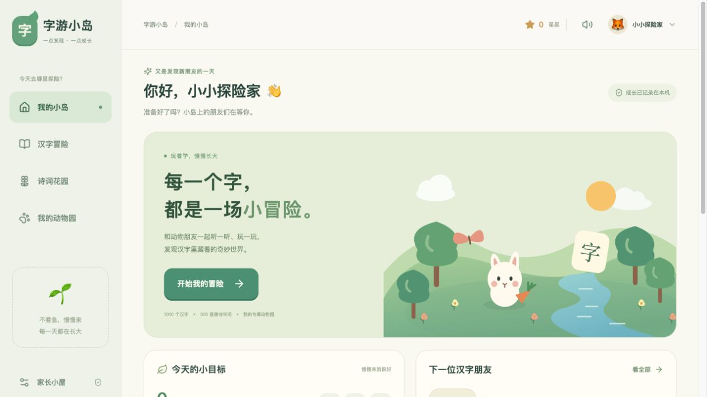
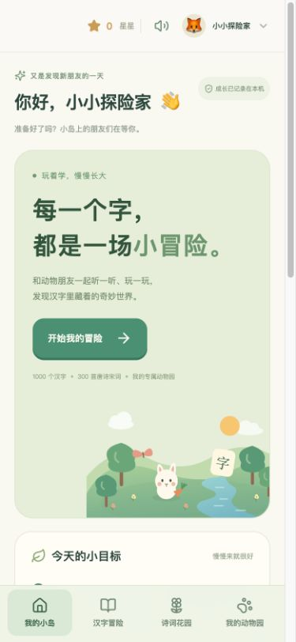

# 字游小岛

给 3 岁起孩子与家长一起使用的中文学习游戏，包含识字、诗词、笔顺练习和可照料的小动物。界面、动物图形与课程解读由本项目编写；本项目不是洪恩官方产品，与洪恩没有关联。

项目免费提供。原创程序、界面、课程解读、活动、音乐及文档采用 [PolyForm Noncommercial License 1.0.0](LICENSE)，允许用途及分发要求以完整许可为准。这是**非商业源码许可（source-available），不是 OSI 开源许可**。第三方代码、笔顺数据及公有领域诗文保持各自的权利状态，见 [第三方声明](THIRD_PARTY_NOTICES.md) 与 [许可核对记录](docs/LICENSING.md)。





## 本地运行

安装 Node.js 22 或更新版本与 npm，在项目目录运行：

```sh
npm ci
npm run dev
```

打开 [http://localhost:5173](http://localhost:5173)。使用已生成的课程与音频不需要 Python、模型下载或付费语音 API。

每个儿童的档案保存在此浏览器、此地址的本机存储中。更换端口或从 `localhost` 换成 IP 地址会使用不同存储空间；可用家长小屋中的 JSON 导入、导出迁移。项目没有云端账号或跨设备自动同步。

```sh
npm test
python3 -B tests/test_kokoro_cache_guard.py
python3 -B tests/test_qwen3_generator.py
npm run audit:content
npm run audio:audit
npm run build
npm run preview
```

开发审计与缓存回归使用系统 Python 3 标准库，无需安装语音模型依赖。`audio:audit` 检查当前语音计划与全部音频文件的映射、AAC 内容及正时长；文件检查不代替听音审核。`build` 输出到 `dist`，`preview` 提供本地构建预览。

## iPad、触控与局域网

网页支持手指点按、拖动物体和分笔书写。书写区域使用 Pointer Events、指针捕获与 `touch-action: none`；离开或取消手势不会把半笔计为完成，第二根手指不会接管正在写的第一根手指。书写区域外保留正常页面滚动，横竖屏均可使用。

生产版可直接开放到局域网，不依赖开发服务器：

```sh
npm run build
npm run serve:lan
```

先停止占用 5173 端口的开发服务器。命令会输出本机局域网地址；iPad 与电脑连接同一 Wi-Fi 后，在 Safari 打开该地址。本次部署地址为 `http://192.168.31.48:5173/`，也可尝试本机 Bonjour 名称 `http://AJunAMacMini.local:5173/`。IP 可能因路由器分配而变化，尽量保持使用同一地址，以免切换本机存档的来源。

在 iPad Safari 点「分享」→「添加到主屏幕」，如有「作为 Web App 打开」选项，请保持开启。随后从主屏幕的「字游小岛」图标打开，使用独立应用窗口；页面右上角也有安装指南及浏览器支持时的全屏入口。应用提供图标、standalone manifest、横竖屏布局与安全区域留白。iPad Air 5 的学习页面按可用屏幕高度排版，游戏画面、描写区与主要操作保留在一屏；汉字每页10个、诗词每页4首，长诗/故事/生活资料、家长设置与动物园使用明确分页或页签，继续学习无需上下滚动。局域网 HTTP 版本需要电脑上的服务运行，不提供离线承诺；没有下载或预缓存全部音频。

在 macOS 上，可安装当前用户的登录启动服务：

```sh
npm run serve:lan:install
```

该命令使用 `launchd`，不需要 sudo。电脑登录后自动启动服务；电脑需要保持开机、联网且未睡眠。日志在 `~/Library/Logs/KidChineseLearner`。停止并移除启动项：

```sh
launchctl bootout gui/$(id -u) "$HOME/Library/LaunchAgents/com.nefeed.kidchineselearner.plist"
rm "$HOME/Library/LaunchAgents/com.nefeed.kidchineselearner.plist"
```

Safari 网页、主屏幕 Web App、不同 IP 或端口可能使用不同存储空间；先在家长小屋导出 JSON，再到新入口导入，可迁移进度。触控与浏览器模拟、网络部署的实际检查记录见 [iPad 验证记录](docs/IPAD_VERIFICATION.md)；模拟器结果不等于真实 iPad 已完成验收。

## 学习内容与玩法

- 1000 个不同汉字及对应笔顺路径、中线，六环节学习、分笔练习和首次过关奖励。
- 300 首唐诗宋词原文、拼音和六环节课程，提供排序、填空与亲子背诵练习。
- 24 种原创 SVG 动物、12 种建筑与 160 个学习奖励；进入动物园先选择六个园区，可喂食、拖动洗澡、命名和保存布局。
- 独立儿童档案、课程阶段和笔画恢复、复习计划、JSON 备份与损坏存档保护。
- 本地普通话合成语音、系统普通话声音后备，以及可独立调整的原创背景音乐。

动物园分为小动物乐园、草原大动物区、森林探险区、鸟儿乐园、蓝色海湾和熊猫竹林。每个园区有相应的场景、动物和建筑；空园区可直接查看入园目标。完成10个汉字或5首诗词后，按「小岛邀请函」中的奖励表领取朋友，领取后自动进入它的园区。已有动物和照顾进度会保留，完整分配表见 [动物园说明与验证](docs/ZOO_VERIFICATION.md)。

1000 字与 300 首是长期内容库，不是 3 岁孩子的达标要求。默认每次 10 分钟、每天 3 字，鼓励亲子交流、生活中的实际练习与随时休息。跟读、朗读和背诵由陪同家长确认，当前不提供自动发音准确度评分。

## 音乐与朗读

《小岛微光》是本项目原创的 16 小节、3/4 拍、72 BPM 音乐，40 秒循环，由 Web Audio 实时合成，没有使用外部录音或采样。默认音乐音量为 22%；朗读期间降至当前音乐音量的 7%，整段朗读及句后停顿结束后再等待 500 毫秒，并用 1.5 秒逐渐恢复。首次点击或触摸后才启动音乐，进入后台暂停；家长小屋可调整音乐开关和音量，设置随儿童档案保存。关闭总声音也会关闭音乐。

朗读使用本机运行的 [Qwen3-TTS 1.7B CustomVoice](https://huggingface.co/Qwen/Qwen3-TTS-12Hz-1.7B-CustomVoice)，通过MLX在Apple Silicon上合成，女声为 **Vivian**（[试听动物园欢迎语](docs/audio-preview/mandarin-female-sample.m4a)）。语气指令为明亮、灵动、亲切，普通话咬字清晰、语速适中、句尾自然。音频属于 **AI合成语音，不是真人录音**。不调用付费云端语音；下载公开模型后，课程文本在离线模式下处理。

**全量新女声已生成并通过发布完整性审计。** 23917条文本映射对应22865份唯一Qwen3录音，累计99180秒。汉字、词语、句子、诗词、学习反馈和六个园区提示使用同一声音；公开音频目录不混用旧Kokoro或Tingting文件。生成器检查每段是否自然结束、波形与AAC时长是否一致，并保留完整末字；录音后补180毫秒静音，播放器默认句后停顿260毫秒。临近结束的新提示会等待上一句，退出、静音和切后台仍立即停止。

录音不再使用Kokoro的0.85生成速度。manifest的 `defaultPlaybackRate: 1.0` 将家长默认朗读档位0.8映射为音频正常速度；播放器再使用固定0.96倍舒缓速率并保留音高，不在句末突然减速或降低音量。多音字保留课程例词语境，明确教学位置采用局部读音提示。资源、配置和媒体事件检查不能代替逐段人类听审，旧Kokoro的音素检查也不能作为新Qwen3的听审证据。生成方法、来源与边界见 [本地Qwen3说明](docs/QWEN3_AUDIO.md)，实际发布配置见 `public/audio/manifest.json`。

本轮还补齐了种树、喂食、颜色与动物园等动态提示的本地录音，避免普通操作切换到系统声音。书写页增加沿笔画移动的星星，修正擦字卡点按、先听后学、静音学习、奖励入口与备份等提示和实际操作不一致的问题。详见 [操作提示与语音验证](docs/INTERACTION_VERIFICATION.md)。

## 内容与音频再生成

普通使用与网页构建无需重新生成课程。开发者再生成内容时使用以下脚本：

- 汉字：`node scripts/build-hanzi.mjs`，然后 `node scripts/build-hanzi-validate.mjs`；后者支持 `--strict-editorial`，检查所有字是否已完成儿童内容编辑。
- 诗词：`python scripts/build-poems.py`，使用 `pypinyin==0.55.0`、`opencc-python-reimplemented==0.1.7`；`--check` 检查结构和对齐。
- 音频计划：`npx tsx scripts/export-audio-plan.mjs narration-plan.json`。计划区分界面标签与实际朗读文本，保留选定的多音字语境。

当前Qwen3生成流程需要Apple Silicon Mac、Python 3.12和macOS自带的AAC编码工具。普通浏览器使用者不需要安装这些开发依赖。

```sh
python3.12 -m venv .audio-cache/qwen3/venv
.audio-cache/qwen3/venv/bin/python -m pip install -r scripts/requirements-qwen3.txt
python3 scripts/download-qwen3-model.py
.audio-cache/qwen3/venv/bin/python scripts/build-qwen3-audio.py --samples --batch-size 8
.audio-cache/qwen3/venv/bin/python scripts/build-qwen3-audio.py --batch-size 16
npx tsx scripts/audit-audio.mjs --complete --directory .audio-cache/qwen3/release --no-write
```

模型revision与两个权重文件的SHA256均固定；下载与生成可以断点恢复，生成阶段禁用云端连接。试听写入独立samples目录；完整录音先写入私有release目录，只有所有录音与当前文本计划都通过检查，才写完整manifest。发布时再替换公开音频并重新构建网页。详细配置、缓存规则和失败重试见 [本地生成说明](docs/QWEN3_AUDIO.md)。

`scripts/build-kokoro-audio.py`、相应读音审计和缓存测试保留为历史版本的开发记录，不是当前女声的生成方式；需要该历史流程时可使用 `npm run audio:legacy-kokoro`。历史Kokoro前端的发音审计不能替代新音源听审。

`scripts/build-audio.mjs` 保留为旧 macOS 系统声音生成流程的开发记录，只写入被 Git 忽略的 `.audio-cache/legacy-macos-audio`，不会覆盖公开音频。其录音不具备本项目公开分享的许可依据，不作为新版公开语音的生成方式。

## 来源与验证

课程的来源、编辑范围和边界见 [产品规格](docs/SPEC.md)、[汉字来源审计](docs/HANZI_SOURCES.md) 与 [诗词来源审计](docs/POETRY_SOURCES.md)。笔顺等第三方材料的完整许可证保留在 [docs/licenses](docs/licenses)。

2026-10-02 的Node 单元测试共 102 项通过，另有 10 项 Python 缓存配置回归通过，包含朗读完成与取消、快速重播、缓存释放、音乐音量恢复、存档和学习奖励规则。浏览器验证覆盖首次操作启动音乐、关闭音乐及音量刷新保存；完整证据、截图和未验证项以 [验证记录](docs/VERIFICATION.md)、[动物园验证](docs/ZOO_VERIFICATION.md) 与 [工作审视报告](docs/REVIEW.md) 为准。iPad Air 5 一屏布局采用双引擎、四种可用视口共410项测试，覆盖游戏完成态、书写与旋转、长诗、满园、20个最长昵称档案及备份名单分页；详细范围见 [iPad 验证记录](docs/IPAD_VERIFICATION.md)。结构和文件审计不能替代儿童使用反馈、教师审核或全量听音。

诗词若缺乏可靠的创作时间与地点，会明确背景不详。现实练习围绕季节、自然、亲情与公共生活；不编造最新事件，不将尚未完成的审核称为已完成。
