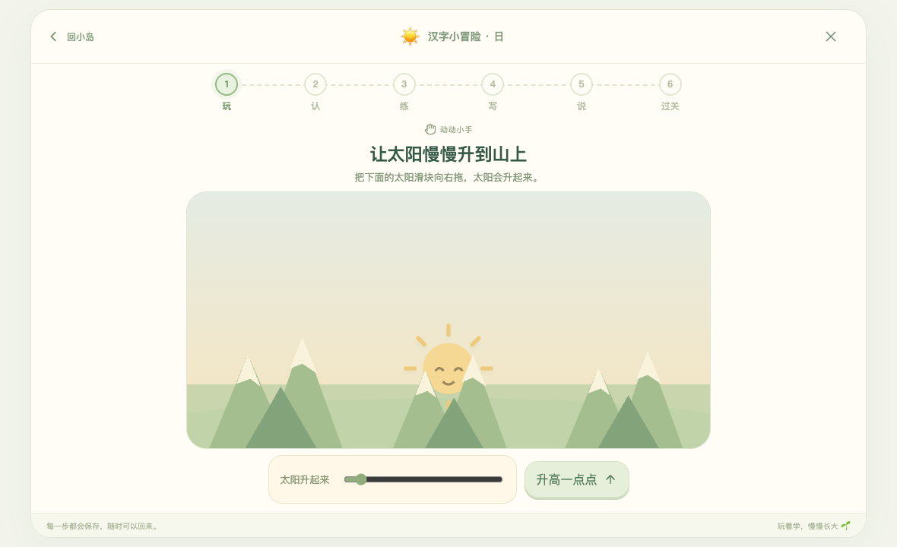
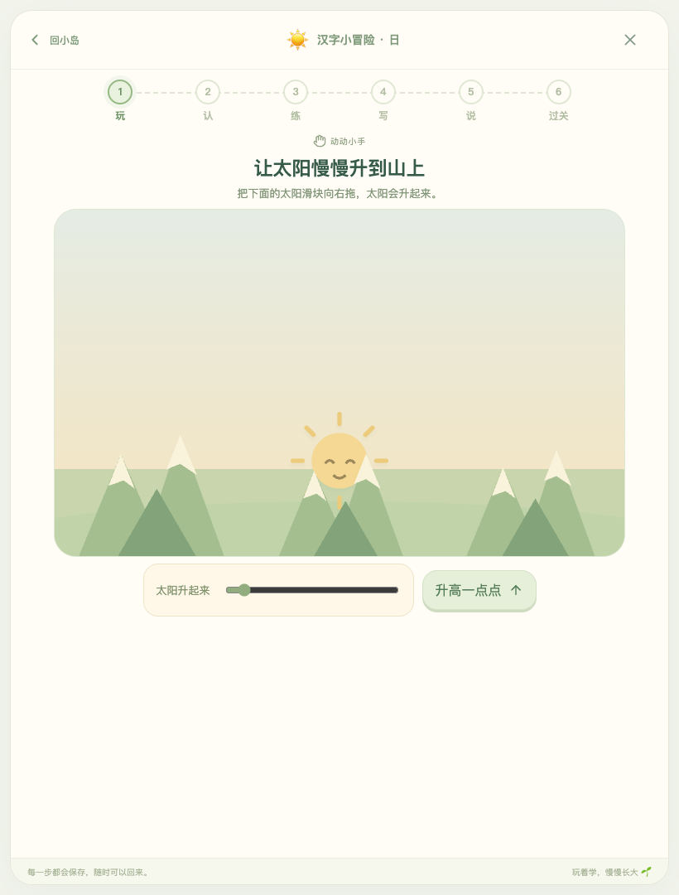

# iPad 与局域网验证

验证日期：2026-10-02。当前工作包括手指点按、书写、拖动与洗澡手势、iPad 横竖屏布局、主屏幕独立窗口与局域网生产服务。

## 实现

- 添加 Apple 主屏幕元数据、`manifest.webmanifest`、167/180 像素 Apple 图标和 192/512 像素应用图标，`display: standalone`，横竖屏不锁定。
- 页面提供安装指引与能力检测后的全屏按钮；主屏幕独立窗口隐藏安装入口。
- 手指书写与拖动使用唯一活动指针，书写区域保留手势，手机普通页面可滚动、平板应用页面保持一屏；取消手势不会完成半笔。
- 生产服务监听 `0.0.0.0:5173`，支持 Safari 音频 Range、HEAD 和缓存校验；登录启动项独立于开发进程。
- 使用局域网 HTTP，不启用 Service Worker，不预缓存整个音频库，不声称离线运行。

## 当前验证

- LAN 服务的两项自动回归通过：音频范围请求与无效范围、HTTP 206、HEAD、304、缺失文件、隐藏文件与只读请求处理。
- PWA 主屏幕与应用窗口：生产构建在独立 Chromium 中8项通过、独立桌面WebKit中7项通过；WebKit跳过1项专属Chromium全屏检查。测试覆盖iPad桌面UA识别、standalone两种检测、图标加载、44×44入口、模态焦点、全屏进入/退出和拒绝时的引导。
- 两引擎在实际局域网HTTP origin加载生产构建，无JavaScript错误、无预请求音频；该origin不是secure context，Service Worker与CacheStorage不可用。
- 生产构建的触控矩阵19/19项通过，含书写、取消、越界、多指隔离、动物拖动、洗澡、草地原生触控与平板页面保持静止、图卡单点与原生滑块拖动。Chromium使用CDP合成Touch→Pointer事件，桌面WebKit使用原生tap与mouse Pointer连续拖动；其中Snow长按在独立组件fixture中验证，因为“雪”不在当前1000字课程中。全部使用隔离浏览器、合成测试存档与临时端口，没有修改实际儿童进度。
- Chromium 与 WebKit 在 375、600、820、1180 像素宽度的另外8项布局检查全部通过：首页、安装指南无横向溢出，工具栏按钮均在视口内，安装入口保持44×44像素。
- 可复查证据：`scripts/verification/ipad-touch-audit.json` 与 `scripts/verification/pwa-audit.json`，包含实际用例结果、事件方式和生产文件摘要。
- 正式生产构建已部署：`http://192.168.31.48:5173/`，macOS当前用户登录服务`com.nefeed.kidchineselearner`处于running，监听`0.0.0.0:5173`。本机对该局域网IP的首页、manifest、主屏幕图标、许可和文档请求均200；AAC范围请求返回206与1024字节。见`scripts/verification/lan-deployment-audit.json`。
- iPad需连接同一局域网，在Safari「分享」→「添加到主屏幕」，如提供「作为Web App打开」选项，保持开启，再从主屏幕图标启动。Mac须开机、登录并保持唤醒；IP若变化须使用新地址。此次未从实体iPad验证路由器隔离或访问。

## 证据边界

独立测试浏览器的 iPad viewport、触控模拟与桌面 WebKit 能验证代码路径和布局，不能证明真实 iPad Safari、屏幕边缘手势或主屏幕安装已经实测。本机没有接入可操作的真实 iPad；最终需在设备上通过本页提供的地址操作确认。

## 2026-10-02 iPad Air 5 一屏布局修复

实际用户反馈指出汉字小冒险需要上下滚动，旧版仅做触控与部分横向溢出检查，未验证每个阶段的纵向可操作性。这次增加固定的动态视口应用框架和学习弹层，让画面与操作使用剩余高度；游戏完成后以结果页显示发现的汉字及继续按钮。

- 汉字目录每页10字，诗词目录每页4首；所有课程仍可通过显式翻页进入。
- 长诗的听读、故事、生活发现和背诵提示分页，保留完整原文、拼音、音频及进度；播放时自动显示当前诗句所在页。
- 家长页分为学习节奏、声音、档案、备份、课程说明；顶部儿童档案切换也分页。
- 动物园照顾/邀请函分视图；草地、收藏、食物、奖励明确分页。
- 新验证检查文档和功能容器的纵向溢出、控件位置与实际命中、文字遮挡和裁切；不会仅以隐藏溢出作为通过依据。
- 目标视口为820×1180、1180×820，以及Safari工具栏占用后的820×1080、1180×720。实体iPad Safari验收仍须由设备上的实际操作确认。

### 本轮验证

- 独立 Chromium 和 WebKit 各205项测试通过，总计410项；其中400项运行正式应用，8项为课程库未包含的Snow独立组件夹具，2项验证检测器能发现裁切和按钮遮挡。覆盖所有专门游戏引擎、汉字六阶段及完成页、诗词各阶段和分页、目录、家长页、顶部档案菜单、休息与安装指南，以及161件满园收藏的全部14片草地和160份奖励页。
- Chromium另以真实CSS环境变量模拟上下各20像素安全边距，最低横屏的51项检查通过；这是浏览器模拟，并未测量实体设备的安全区域。
- 20个合法16字昵称档案的首页、菜单与家长页均检查；备份预览每页显示2个完整名字，10页拼接仍含全部档案，确认与取消按钮始终在屏幕内。
- 触控回归19项、动物园回归7项通过；主屏幕/PWA回归Chromium8项、WebKit7项通过，WebKit明确跳过1项Chromium全屏用例。书写画布还按系统安全边距扣减可用尺寸。
- 额外检查全部300首诗在1180×720的4,944个真实组件画面：所有阅读、故事与显示的背诵页文字拼接一致，0溢出、离屏或运行错误。此补审替换了朗读回调，不代表已实际听音。
- 全库阶段静态渲染20,479次、209,359项断言通过，内容审计仍为1000字/300首，朗读计划与22,453份录音保持一致。
- 正式部署保持原地址 `http://192.168.31.48:5173/`。已打开的Safari网页需要刷新；主屏幕窗口可关闭后重新打开。
- 带测试逐项结果、生产文件摘要及命令的证据：`scripts/verification/ipad-one-screen-audit.json`、`ipad-touch-audit.json`、`poem-one-screen-audit.json`、`pwa-audit.json` 与 `lan-deployment-audit.json`。

正式生产构建截图：

