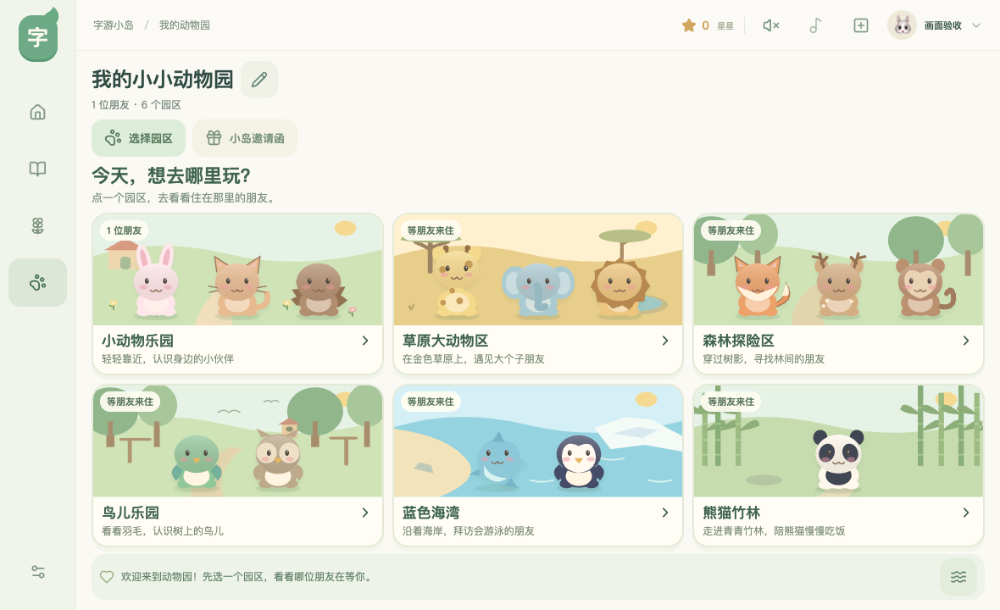
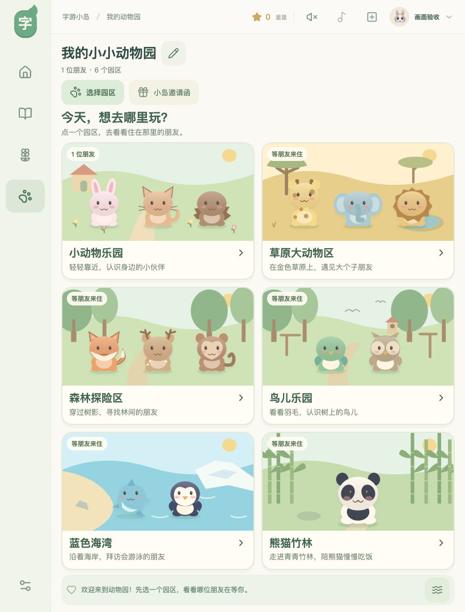
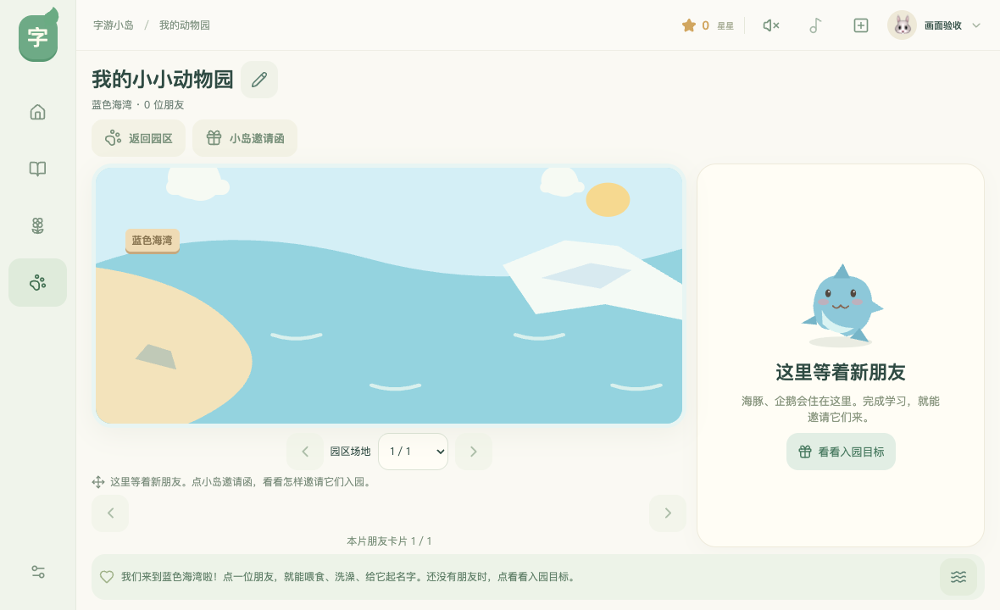

# 动物园分区与验证

验证日期：2026-10-02至2026-10-03。网页入口先显示六个园区，点选后进入相应场景；各园区有独立的动物名单、建筑和场地分页。

| 园区 | 动物 |
|---|---|
| 小动物乐园 | 兔子、猫、狗、猪、刺猬、乌龟 |
| 草原大动物区 | 大象、长颈鹿、狮子、斑马、河马、犀牛 |
| 森林探险区 | 狐狸、老虎、考拉、松鼠、鹿、熊、猴子 |
| 鸟儿乐园 | 猫头鹰、鹦鹉 |
| 蓝色海湾 | 企鹅、海豚 |
| 熊猫竹林 | 熊猫 |

六个园区均可参观，卡片标明已入住朋友的数量。尚未入住的园区展示「看看入园目标」，打开邀请函中对应的学习奖励。学习每完成10个汉字或5首诗词，可按奖励表领取一份礼物；领取后自动进入礼物所属园区。初始小兔住在小动物乐园，学完10个汉字可邀请熊猫。没有新增付费解锁或虚构的探险捕捉玩法。

24种动物和12种建筑各有唯一归属；160个学习奖励保持不变。分类从物种推导，不改变旧存档格式、名字、饱腹、清洁、亲密度或领取状态。旧存档坐标仍被保留；同一园区里位置冲突时，界面重新排列以保证可以点到，布置时选中的朋友优先。

## 最终暂存生产包

2026-10-03，完整Qwen3音频与六园区一起构建后，园区/动物园15项、真实AAC12项、触控30项及双引擎全页布局448项、安全边距55项全部通过。记录见 `scripts/verification/qwen3-release-audit.json`。以下保留功能开发阶段的检查过程。

## 本轮已执行

- Node单元测试109项通过，包括所有动物与建筑的唯一归属、旧坐标冲突排布、选中动物移动，以及音频发布检查。
- 新园区浏览器交互8项通过：Chromium与WebKit各覆盖横屏1180×720和竖屏820×1080，检查入口选择、空园区、学习目标、领取后入园、喂食改名与刷新恢复。
- 原动物园回归7项通过；覆盖食物、拖动洗澡、命名、布局、领取去重、全部160份礼物和初始小兔的六园区完整遍历。
- 园区相关一屏布局双引擎各12项通过，另有20像素安全边距3项通过。检查页面和内部区域的纵向溢出、按钮边界及中心命中，满园场景逐园区、逐页检查。
- 合入远端自然触摸测试驱动后，完整触控回归30项通过；提示导航Chromium与WebKit各7项通过。触控用例覆盖拖动、多指排除和取消；测试已改为先选择园区，再进入照顾操作。
- 人工查看横屏、竖屏入口与空海湾截图，六个入口、场景、提示和操作栏均在画面内。

触控全套最初有一条用例还在入口直接寻找「洗澡」，因此超时；更新为先进入小动物乐园后重跑29项全部通过。随后合入远端的测验修复与自然缓出收笔驱动，再次运行109项单元测试、30项触控测试和TypeScript编译，全部通过。没有放宽触控或布局断言。

## 重现

```sh
npm run dev
ZOO_TEST_URL=http://127.0.0.1:5173 npx playwright test tests/zoo-regions.spec.ts tests/zoo.spec.ts --workers=1
IPAD_TEST_URL=http://127.0.0.1:5173 npx playwright test tests/ipad-touch.spec.ts --workers=1
IPAD_LAYOUT_TEST_URL=http://127.0.0.1:5173 IPAD_LAYOUT_ENGINE=webkit npx playwright test tests/ipad-layout.spec.ts --grep 'zoo|reward invitation' --workers=1
```

测试使用独立浏览器与合成学习进度，不改写日常儿童档案。浏览器视口与触控检查不能代替真实iPad上由孩子使用的验收；合成进度不代表儿童已学完课程。新女声的合成与发布记录单独记载在语音验证文档中。







最终布置提示与园区播报统一后，最终包补查46项全部通过：动物园与原生AAC19项、双引擎园区布局24项、安全边距3项；明细与最终包摘要保存在 `scripts/verification/qwen3-release-audit.json`。
